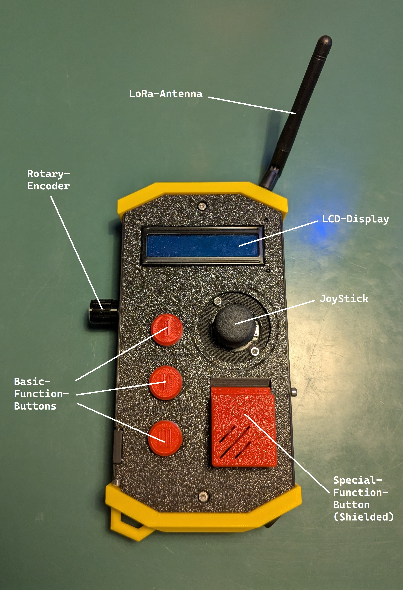

# MagicBox

    

The MagicBox is a WiFi/BlueTooth- and LoRa-able, programmable radio controller for a large range of applications. Equipped with an ESP32 MCU, the controller can host quite challenging tasks and code. It's various input and output devices include:

- LCD Display
- Buzzer
- Rotary encoder
- Joystick
- 3 open and 1 shielded button

For more information, see the hardware reference [here](./documentation/hardware_reference.md).

### Software

The [magicontent](https://github.com/SamuelNoesslboeck/magicontent) library, provides a basic API for the controller, defining all pins and providing demo programs to test the controllers functionality. 