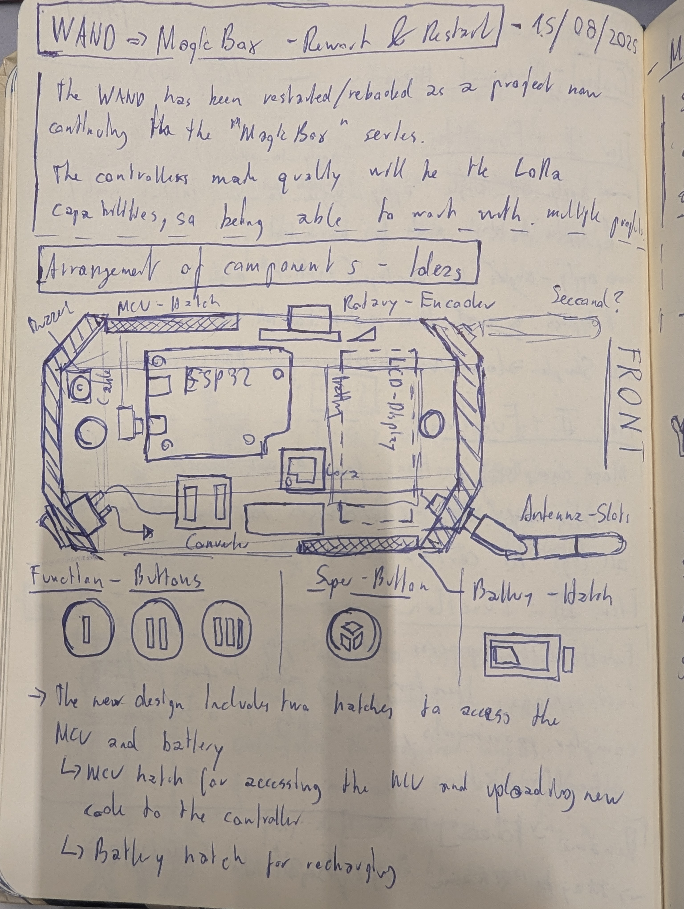
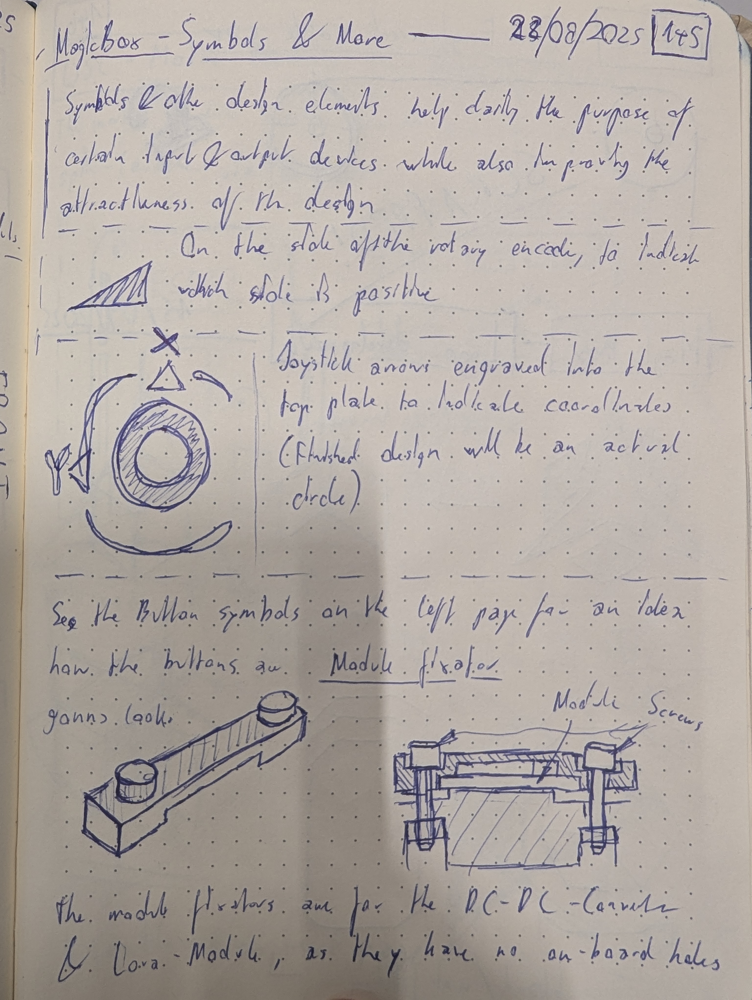
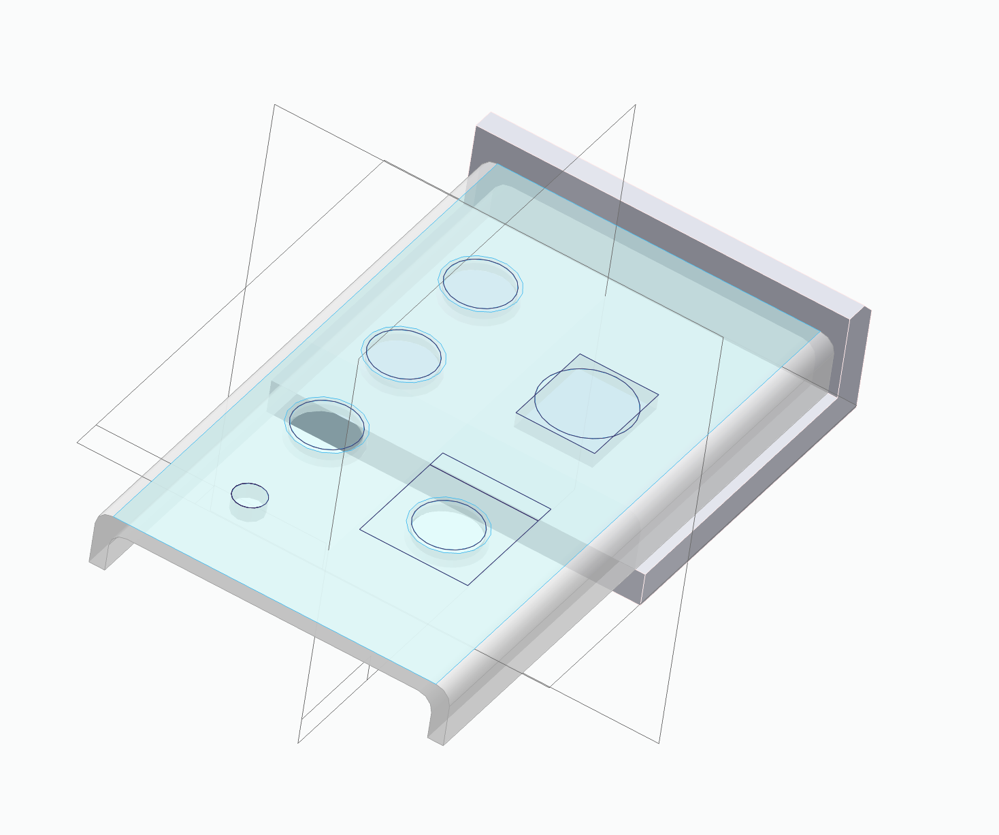
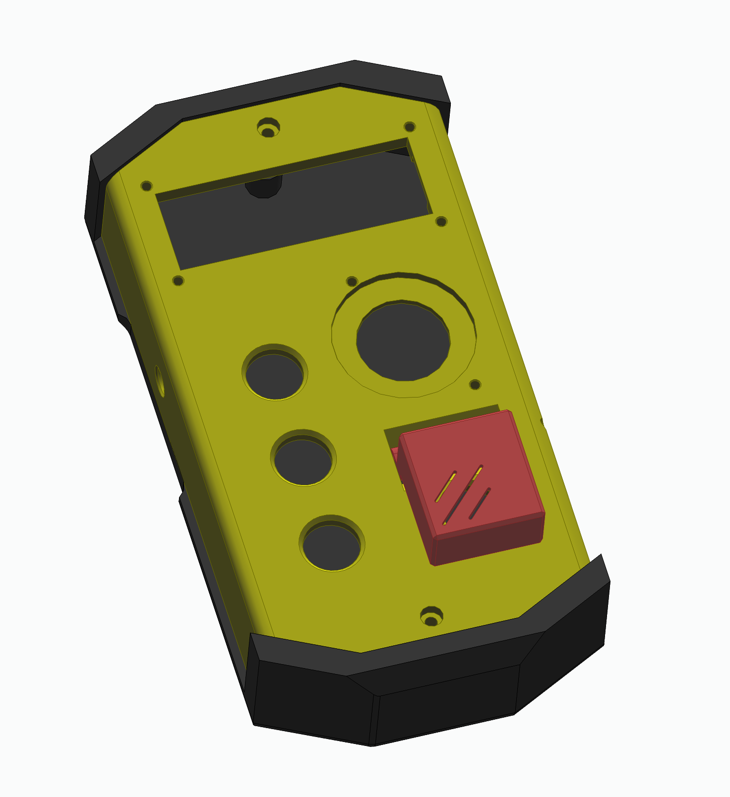

# Project log - MagicBox

## New design Kick-Off (15/08/2025)

The controllers shape and colour scheme was inspired by controllers for cranes/robot arms and classical depictions of detonators.

    
    

## First steps to final model

    
    

## Adjusting libraries and core software (20/10/2025)

The `magicontent` repo has been repurposed as a API/library repo instead of operating sketches for the controller, alongside the `sylo` library which has also been brought up to current standards.

## Finishing first release (22/10/2025)

The release has been finished off by bringing the project log up to date, adding images of sketches and the controller itself and finishing up the hardware reference, correctly describing components used and how they are connected. Future improvements include: 

- Voltage divider added to battery in order to measure battery voltage -> Measure current battery level percent
- Include button events and other features into general `sylo` library