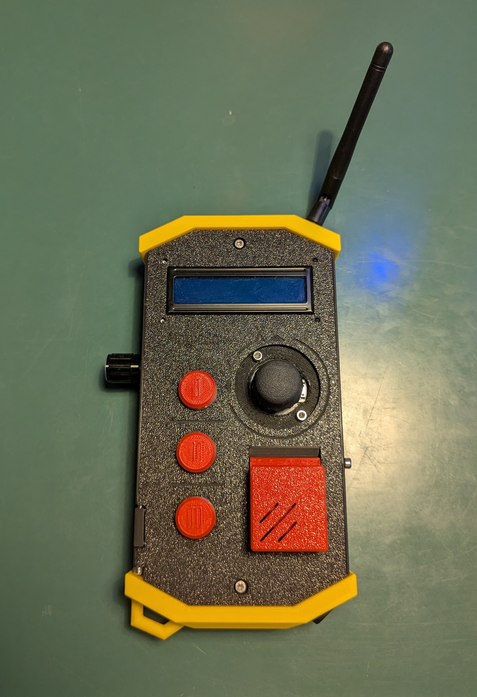

# Project log - MagicBox

## New design Kick-Off (15/08/2025)

The controllers shape and colour scheme was inspired by controllers for cranes/robot arms and classical depictions of detonators. The focus is set on the LoRa-Connection part, as extending the Bluetooth module of the ESP32 with an antenna is not the easiest thing to do, if the ESP does not have an antenna slot built-in.

    
    

## First steps to final CAD model

    
    

As it can be seen in the first build section, the orientation of the ESP32 has been changed later on, as it provides more space and better build-up of the other components.

## Road to first build

    
    

### Unexpected behaviour issue

During the first build, to be precise during the first tests, an issue occurred where random button inputs have been triggered. The cause of this issue, after quite some tinkering, has been found to be the cause of too high voltage being supplied to the input methods. The ESP32 uses 3.3V as it's operating and input voltage, so supplying 5V to it causes undefined behaviour according to multiple sources. In this case after proper rewiring (also making sure every input mean has the right pull-down attached) the issue has been fixed too.

## Adjusting libraries and core software (20/10/2025)

The `magicontent` repo has been repurposed as a API/library repo instead of operating sketches for the controller, alongside the `sylo` library which has also been brought up to current standards.

## Finishing first release (22/10/2025)

    
    

The release has been finished off by bringing the project log up to date, adding images of sketches and the controller itself and finishing up the hardware reference, correctly describing components used and how they are connected. Future improvements include: 

- Voltage divider added to battery in order to measure battery voltage -> Measure current battery level percent
- Include button events and other features into general `sylo` library